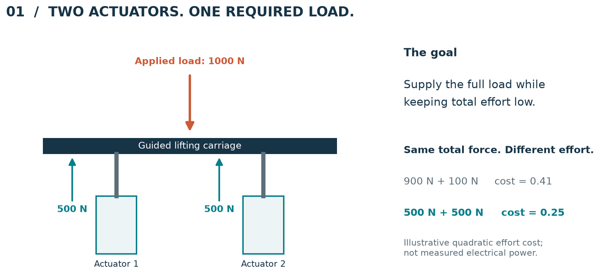
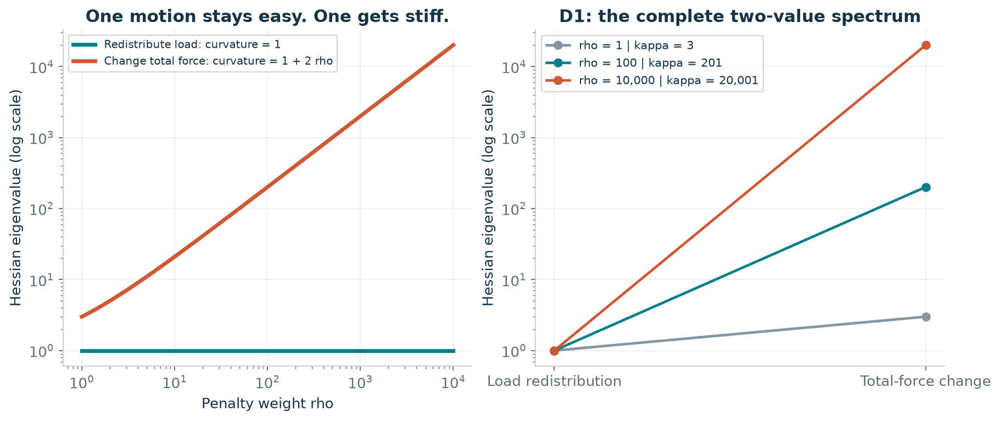
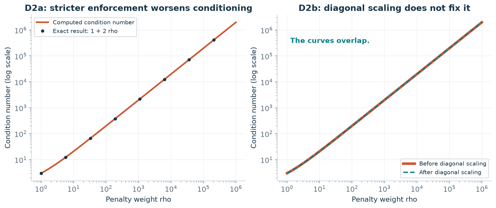
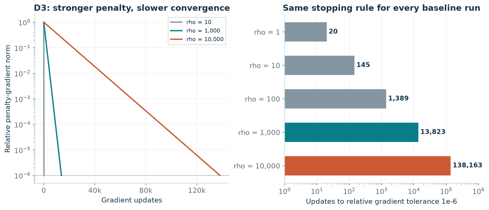
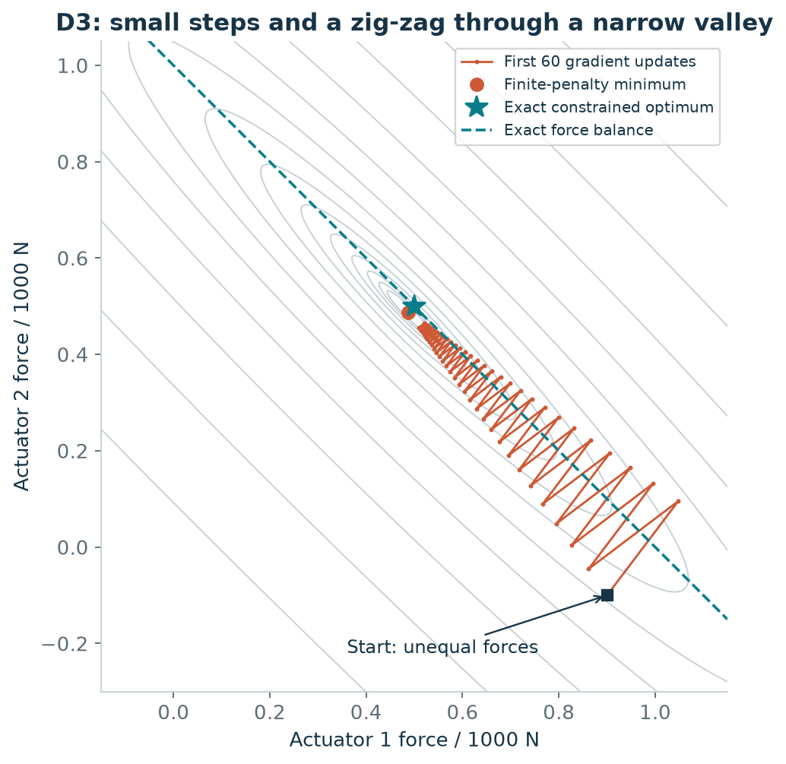
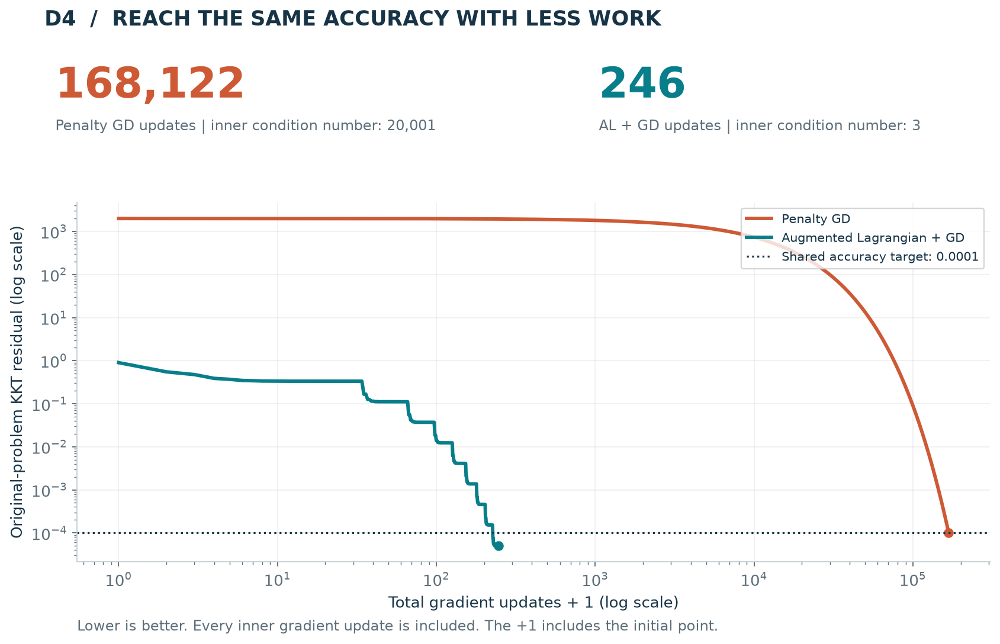

# Two Actuators, One Load
### Why stricter force balance can make optimization slower

**MAE 598 · Project 2 · TheDESIGNOptimizers**

> **The project in one sentence:** Two actuators must share a load; a large force-balance penalty slows gradient descent, while an augmented Lagrangian reaches the same accuracy with far fewer updates.

**Result in this experiment:** **168,122** gradient updates with the penalty method versus **246** with the augmented Lagrangian. Both finish with less than **0.1 N** of total-force error. The sections below explain what was optimized, why the first method struggled, and how the second method helped.

## 1. The engineering problem

Imagine two identical linear actuators supporting a guided lifting carriage. Together, they need to provide **1000 N** of upward force. A controller must decide how much force each actuator supplies.



*Figure 1. Equal sharing minimizes our quadratic effort cost. Both example allocations supply the same total force; their effort costs differ.*

Why not put most of the load on one actuator? Our simplified effort cost grows with the **square** of force. A 900 N / 100 N split therefore costs more than a 500 N / 500 N split. This models an idealized resistive-loss effect: if force is proportional to current, then resistive loss is proportional to force squared.

The physical answer is simple: **500 N per actuator**. The purpose of the project is to explain why an optimizer can still take a long time to find an accurate allocation when force balance is enforced using a large penalty.

## 2. What we optimize

We divide forces by 1000 N to keep the mathematics compact. For example, a normalized force of $q_1=0.5$ means $F_1=500\ \mathrm{N}$.

| Symbol | Meaning | Units, size, and bounds |
|---|---|---|
| $F_1,F_2$ | Physical actuator forces | N; two continuous scalars; $F_i\in\mathbb R$ |
| $q=(q_1,q_2)^\top$ | Forces divided by 1000 N; our decision vector | Dimensionless; two continuous variables; $q_i\in\mathbb R$ |
| $\rho$ | How strongly the penalty method penalizes force imbalance | Dimensionless; positive scalar parameter |
| $\beta$ | Fixed penalty used by the augmented Lagrangian | Dimensionless; positive scalar parameter |
| $y$ | Accumulated force-balance correction, or multiplier | Dimensionless; unrestricted scalar dual variable |

The actuators are idealized as bidirectional with no capacity limits, so negative forces are allowed. All constraints are written below; there are no hidden bounds.

**Minimize effort:**

$$J(q)=\frac12(q_1^2+q_2^2).$$

**Supply the required force:**

$$q_1+q_2=1.$$

This is a **continuous, deterministic, strictly convex quadratic program with one linear equality constraint**. Its unique optimum is $q^\star=(0.5,0.5)$, with $J^\star=0.25$.

### Turning the constraint into a penalty

Define imbalance as $g(q)=q_1+q_2-1$. The penalty method instead minimizes

$$F_\rho(q)=\underbrace{\frac12(q_1^2+q_2^2)}_{\text{actuator effort}}+\underbrace{\frac\rho2(q_1+q_2-1)^2}_{\text{force-imbalance penalty}}.$$

**Larger $\rho$ makes force imbalance more expensive.** However, any finite penalty still permits a small imbalance. Its exact optimizer is

$$q_\rho^\star=\left(\frac\rho{1+2\rho},\frac\rho{1+2\rho}\right),\qquad |g(q_\rho^\star)|=\frac1{1+2\rho}.$$

For example, $\rho=10{,}000$ gives an exact penalty-solution force deficit of about **0.05 N**. We will see that obtaining this accuracy through a large penalty creates a numerical cost.

<details>
<summary><strong>Mathematical detail: where the effort model comes from</strong></summary>

Assume $F_i=K_f I_i$ and resistive power $P_i=RI_i^2$ for identical ideal actuators. Then $P=c(F_1^2+F_2^2)$ with $c=R/K_f^2>0$. Dividing power by $2c(1000\ \mathrm N)^2$ gives $J=(q_1^2+q_2^2)/2$. This represents an idealized loss proxy, not a complete electrical-power model.

Let $a=(1,1)^\top$. The original Lagrangian is $\mathcal L(q,y)=J(q)+y(a^\top q-1)$. Its stationarity and feasibility equations are $q+ya=0$ and $a^\top q=1$. Solving them yields $q^\star=(0.5,0.5)$ and $y^\star=-0.5$.

</details>

## 3. Why the optimizer struggles

This is **family G: ill-conditioning caused by a penalty reformulation**.

There are two ways the forces can change:

| Motion | Example | What the penalty sees |
|---|---|---|
| Redistribute the load | Increase one force and decrease the other equally | Total force stays the same; no additional force-balance penalty |
| Change total force | Increase or decrease both forces together | Total force changes; a large penalty reacts strongly |

These two motions have different curvatures. The Hessian, which describes local curvature, is

$$H_\rho=\begin{bmatrix}1+\rho&\rho\\\rho&1+\rho\end{bmatrix}.$$

Its eigenvalues are **1** for redistribution and **$1+2\rho$** for total-force change. Their ratio is the condition number:

$$\boxed{\kappa=1+2\rho.}$$

**Interpretation:** the optimizer must use small steps to handle the stiff total-force direction, even though redistribution could tolerate larger steps.



*Figure 2 — D1. One curvature remains at 1 while the other grows. At $\rho=10{,}000$, their ratio is 20,001.*

### Is this just a units problem? The required intrinsic test

**No.** First, $\kappa$ grows as the structural parameter $\rho$ increases. Second, diagonal (Jacobi) rescaling leaves $\kappa$ unchanged: both diagonal entries are $1+\rho$, so the rescaling divides both eigenvalues by the same number.



*Figure 3 — D2. Both required tests pass: growth with penalty weight, and survival after diagonal rescaling.*

<details>
<summary><strong>Derivation and small-case hand check</strong></summary>

The redistribution direction is $v_t=(1,-1)^\top/\sqrt2$ and the total-force direction is $v_n=(1,1)^\top/\sqrt2$. Direct multiplication gives $H_\rho v_t=v_t$ and $H_\rho v_n=(1+2\rho)v_n$.

With $D=\operatorname{diag}(H_\rho)=(1+\rho)I$, the Jacobi-scaled matrix is

$$D^{-1/2}H_\rho D^{-1/2}=\frac{H_\rho}{1+\rho}.$$

Its eigenvalues are $1/(1+\rho)$ and $(1+2\rho)/(1+\rho)$, with the same ratio $1+2\rho$.

At $\rho=1$, $H=\left[\begin{smallmatrix}2&1\\1&2\end{smallmatrix}\right]$ has eigenvalues 1 and 3. After Jacobi scaling, they are 0.5 and 1.5. The condition number is **3 in both cases**. “Intrinsic” here means the assignment's two-part test; it does not mean no non-diagonal coordinate change can help.

</details>

## 4. Showing the slowdown

Our baseline is **gradient descent**: repeatedly move downhill along the negative gradient. We use the optimal constant step for this quadratic, $\alpha=1/(1+\rho)$, so the slowdown is not caused by an arbitrarily bad step size.

Every run starts at $q_0=(0.9,-0.1)$, or $(900,-100)\ \mathrm N$. This unequal allocation excites both directions; a perfectly symmetric start could hide part of the conditioning problem.



*Figure 4 — D3. Increasing the penalty from 1 to 10,000 increases the required updates from 20 to 138,163. Each run stops at the same relative gradient tolerance, $10^{-6}$, for its own penalty objective.*

| Penalty $\rho$ | Condition number $\kappa$ | Gradient updates |
|---:|---:|---:|
| 1 | 3 | 20 |
| 10 | 21 | 145 |
| 100 | 201 | 1,389 |
| 1,000 | 2,001 | 13,823 |
| 10,000 | 20,001 | 138,163 |

The required two-variable path makes the effect visible:



*Figure 5 — D3. At $\rho=20$, the algorithm zig-zags across the valley while progressing along it. The penalty minimum and exact constrained optimum are different because a finite penalty permits imbalance.*

<details>
<summary><strong>Why the measured iteration counts make sense</strong></summary>

The iteration matrix has eigenvalues $+r$ and $-r$, where $r=\rho/(1+\rho)$. Thus the relative gradient norm is $r^k$ after $k$ updates. The predicted count to tolerance $\tau$ is

$$k=\left\lceil\frac{\log\tau}{\log(\rho/(1+\rho))}\right\rceil.$$

The code verifies every count in the table. At $\rho=1$, the gradient norm halves per update: $2^{-19}>10^{-6}$ and $2^{-20}<10^{-6}$, so **20 updates** are needed. The first gradient is $(0.7,-0.3)$, giving the first iterate $(0.55,0.05)$ with step 0.5. This is also checked in code.

The relative objective gap contracts as $r^{2k}$. The finite-penalty minimum value is $F_\rho^\star=\rho/[2(1+2\rho)]$, which is different from the original constrained objective value $J^\star=1/4$.

</details>

## 5. The fix: accumulate a correction instead of using a huge penalty

The **augmented Lagrangian** adds a multiplier $y$ that accumulates the signed force-balance error. Its subproblem is

$$\mathcal L_\beta(q,y)=J(q)+y\,g(q)+\frac\beta2g(q)^2.$$

The procedure is:

1. **Adjust the forces:** approximately minimize $\mathcal L_\beta$ using gradient descent.
2. **Measure the imbalance:** compute $g(q)=q_1+q_2-1$.
3. **Update the correction:** set $y\leftarrow y+\beta g(q)$ and repeat.

We keep **$\beta=1$**, so every inner Hessian has condition number **3**. The multiplier improves force balance without making the penalty enormous. We start with $y=0$, warm-start each inner force solve, and count **all** its gradient updates.

### Compare both methods at the same accuracy

The earlier baseline table solved different finite-penalty problems. For this comparison, both methods must satisfy the **original** constrained problem to the same tolerance. We check both:

- **Force balance:** are the two forces adding up accurately?
- **Stationarity:** is the allocation consistent with the effort-minimizing solution and multiplier?

Their combined measure is the KKT residual:

$$r_{\mathrm{KKT}}=\max\left(\lVert q+ya\rVert_\infty,\ |q_1+q_2-1|\right),\qquad a=(1,1)^\top.$$

Both methods must reach $r_{\mathrm{KKT}}\le10^{-4}$. The force-balance part means an error no larger than **0.1 N**. This is a chosen numerical tolerance, not a validated hardware specification.



*Figure 6 — D4. The augmented Lagrangian reaches the shared target much earlier. The horizontal axis counts every inner gradient update; both axes use logarithmic scales to make the two histories readable.*

| Measured result | Penalty + gradient descent | Augmented Lagrangian + gradient descent |
|---|---:|---:|
| Penalty used | $\rho=10{,}000$ | $\beta=1$ |
| Inner condition number | 20,001 | 3 |
| Total gradient updates | **168,122** | **246** |
| Gradient evaluations | 168,123 | 255 |
| Multiplier updates | 0 | 9 |
| Final force error | 0.05001 N | 0.05081 N |
| Final stationarity residual | $9.9993\times10^{-5}$ | $7.2678\times10^{-11}$ |

**What this demonstrates:** the augmented Lagrangian uses about **683 times fewer gradient updates** for this experiment. This is an iteration-count comparison, not a claim of universal runtime speedup. Both methods approach the same ideal allocation of 500 N per actuator.

<details>
<summary><strong>Exact solver settings and why nine outer iterations are reasonable</strong></summary>

For the penalty method, set $y=\rho g(q)$ when checking the KKT residual. Its stationarity residual is then the penalty gradient. Use $\rho=10{,}000$ and step $1/10{,}001$.

For the augmented Lagrangian, use $\beta=1$, step $1/2$, and absolute inner gradient infinity-norm tolerance $10^{-10}$. Update the multiplier after each inner solve; check the final KKT condition after that update. Inner iteration work is included in the reported total. Initial multipliers follow each method's definition, rather than being equal.

With exact inner solves,

$$q^{t+1}=\frac{\beta-y^t}{1+2\beta}a,\qquad y^{t+1}=\frac{y^t-\beta}{1+2\beta}.$$

At $\beta=1$ and $y^0=0$, the force deficit after outer iteration $t\ge1$ is $3^{-t}$. Since $3^{-8}>10^{-4}$ and $3^{-9}<10^{-4}$, nine outer iterations are predicted. The code confirms this within the inner-solve tolerance. It does **not** use this closed-form inner solution to generate the measured AL update count.

The count of 138,163 in Section 4 and 168,122 here use **different stopping rules**: relative penalty-gradient norm versus absolute original-problem KKT residual. They answer different questions.

</details>

## 6. Assumptions and what the result means

- The actuators are identical, bidirectional, and unlimited in force; real capacity limits would require additional constraints.
- The carriage is guided. We model static axial force balance, not moments, vibration, friction, or control-system dynamics.
- Squared force is an idealized effort proxy. No experimental power or efficiency measurements are claimed.
- Demand is fixed, derivatives are exact, and the experiment contains no measurement noise.
- Intermediate numerical iterates are offline calculations, not force commands to real hardware.
- Two variables permit an analytical solution. A direct solve is more practical here; iterative methods expose the conditioning mechanism for teaching purposes.

**The central lesson:** the physical optimization problem is simple, but a large penalty makes its numerical formulation difficult. A multiplier allows accurate constraint enforcement while keeping the inner problems well conditioned.

## Reproduce the results

Use Python 3.12. In this folder, run:

```bash
python -m pip install -r requirements.txt
python run_project.py
```

The script regenerates all six figures and the result tables under `results/`. It checks the eigenvalues, scaling test, exact reference solution, small-case iteration count, and both final stopping conditions. The experiments are deterministic; seed 598 is fixed. Small floating-point differences across platforms are possible.

For convenience, the **complete runnable script is also included below**. This makes this Markdown file a complete report with runnable code. The separate `.py` file is the same code, ready to execute.

<details>
<summary><strong>Open the complete runnable Python code</strong></summary>

```python
"""Reproduce the actuator study and all figures: python run_project.py."""
from pathlib import Path
import csv
import json
import os
import tempfile

# A writable plotting cache; this does not change user-wide settings.
os.environ.setdefault('MPLCONFIGDIR', str(Path(tempfile.gettempdir()) / 'mae598-matplotlib'))
import numpy as np
import matplotlib
matplotlib.use('Agg')
import matplotlib.pyplot as plt
from matplotlib.patches import Rectangle, FancyArrowPatch
from matplotlib.ticker import MaxNLocator, FuncFormatter

ROOT = Path(__file__).resolve().parent
OUT = ROOT / 'results'
OUT.mkdir(exist_ok=True)
np.random.seed(598)  # All experiments below are deterministic.
A = np.ones(2)
Q0 = np.array([0.9, -0.1])
QSTAR = np.array([0.5, 0.5])
TOL = 1e-4
INK, MUTED = '#173447', '#5c6e79'
TEAL, ORANGE, PALE = '#087e8b', '#cd5935', '#edf4f6'
plt.rcParams.update({'font.family': 'DejaVu Sans', 'font.size': 11,
    'text.color': INK, 'axes.labelcolor': INK, 'xtick.color': MUTED,
    'ytick.color': MUTED, 'axes.edgecolor': '#c6d0d5',
    'axes.spines.top': False, 'axes.spines.right': False,
    'axes.titleweight': 'bold', 'axes.titlecolor': INK,
    'figure.facecolor': 'white', 'axes.facecolor': 'white',
    'savefig.dpi': 170})

def constraint(q):
    return q.sum() - 1.0

def H(rho):
    return np.eye(2) + rho * np.outer(A, A)

def grad(q, rho):
    return q + rho * constraint(q) * A

def q_penalty(rho):
    return rho / (1 + 2*rho) * A

# Adapted from the assignment's generic diagnostic helpers.
def spectrum(matrix):
    ev = np.linalg.eigvalsh(matrix)
    assert ev[0] > 0
    return ev, ev[-1]/ev[0]

def jacobi_condition(matrix):
    d = np.sqrt(np.diag(matrix))
    return spectrum(matrix/np.outer(d, d))[1]

def gd(rho, relative_tol=1e-6):
    q = Q0.copy()
    xs, norms = [q.copy()], [np.linalg.norm(grad(q, rho))]
    for k in range(200001):
        if norms[-1] <= relative_tol*norms[0]:
            return np.array(xs), np.array(norms)
        if k == 200000:
            raise RuntimeError('Baseline did not converge.')
        q -= grad(q, rho)/(1+rho)
        xs.append(q.copy())
        norms.append(np.linalg.norm(grad(q, rho)))

def metrics(q, y):
    stationarity = float(np.max(np.abs(q+y*A)))
    feasibility = float(abs(constraint(q)))
    return stationarity, feasibility, max(stationarity, feasibility)

def penalty_solve(rho=10000):
    q = Q0.copy()
    history = []
    for k in range(300001):
        y = rho*constraint(q)
        g = q+y*A
        m = metrics(q, y)
        history.append(m)
        if m[2] <= TOL:
            return dict(q=q, updates=k, grad_evals=k+1, outer=0,
                        work=np.arange(k+1), history=np.array(history))
        if k == 300000:
            raise RuntimeError('Penalty comparison did not converge.')
        q -= g/(1+rho)

def alm_solve(beta=1, inner_tol=1e-10):
    q, y = Q0.copy(), 0.0
    updates = grad_evals = 0
    work, history, outer_rows = [0], [metrics(q, y)], []
    for t in range(1, 51):
        before = updates
        for _ in range(1000):
            g = q+(y+beta*constraint(q))*A
            grad_evals += 1
            if np.max(np.abs(g)) <= inner_tol:
                break
            q -= g/(1+beta)
            updates += 1
            work.append(updates)
            history.append(metrics(q, y))
        else:
            raise RuntimeError('AL inner solve did not converge.')
        y += beta*constraint(q)
        work.append(updates)
        history.append(metrics(q, y))
        outer_rows.append([t, updates-before, updates, *history[-1]])
        if history[-1][2] <= TOL:
            return dict(q=q, updates=updates, grad_evals=grad_evals, outer=t,
                        work=np.array(work), history=np.array(history), outer_rows=outer_rows)
    raise RuntimeError('AL outer loop did not converge.')

def save(fig, name):
    fig.savefig(OUT/name, bbox_inches='tight', facecolor='white')
    plt.close(fig)

def csv_save(name, headers, rows):
    with (OUT/name).open('w', newline='', encoding='utf-8') as f:
        writer = csv.writer(f)
        writer.writerow(headers)
        writer.writerows(rows)

def axis_style(ax):
    ax.grid(alpha=.18)
    ax.set_axisbelow(True)

def short_work(ax):
    ax.xaxis.set_major_locator(MaxNLocator(nbins=4, integer=True))
    ax.xaxis.set_major_formatter(FuncFormatter(lambda x, p: f'{x/1000:g}k' if x>=1000 else f'{x:g}'))

def main():
    # The calculation is unchanged from the original, verified notebook.
    baselines, baseline_rows = {}, []
    for rho in [1, 10, 100, 1000, 10000]:
        xs, norms = gd(rho)
        n = len(xs)-1
        predicted = int(np.ceil(np.log(1e-6)/np.log(rho/(rho+1))))
        assert n == predicted
        baselines[rho] = (xs, norms)
        baseline_rows.append([rho, 1+2*rho, n, predicted])
    pure, alm = penalty_solve(), alm_solve()
    intrinsic = [[r, spectrum(H(r))[1], jacobi_condition(H(r)), 1/(1+2*r)]
                 for r in [1, 10, 100, 1000, 10000, 1000000]]
    comparison = [[name, cond, run['updates'], run['grad_evals'], run['outer'],
                   *run['history'][-1], 1000*run['history'][-1,1]]
                  for name, cond, run in [('Penalty GD', 20001, pure), ('AL + GD', 3, alm)]]
    csv_save('baseline_counts.csv', ['rho','kappa','updates','predicted_updates'], baseline_rows)
    csv_save('intrinsic_test.csv', ['rho','kappa','kappa_jacobi','exact_force_deficit'], intrinsic)
    csv_save('method_comparison.csv', ['method','inner_kappa','updates','gradient_evaluations',
             'dual_updates','stationarity','feasibility','kkt_residual','force_error_N'], comparison)
    csv_save('alm_outer_iterations.csv', ['outer','inner_updates','cumulative_updates',
             'stationarity','feasibility','kkt_residual'], alm['outer_rows'])

    # Hand checks, independent reference solution, and common stopping rule.
    np.testing.assert_allclose(spectrum(H(1))[0], [1,3])
    np.testing.assert_allclose(jacobi_condition(H(1)), 3)
    np.testing.assert_allclose(Q0-.5*grad(Q0,1), [.55,.05], atol=1e-15)
    assert len(baselines[1][0])-1 == 20
    for rho, kappa, kj, _ in intrinsic:
        np.testing.assert_allclose([kappa,kj], [1+2*rho]*2, rtol=1e-9)
        np.testing.assert_allclose(np.linalg.solve(H(rho),rho*A),q_penalty(rho),rtol=1e-9)
    K = np.block([[np.eye(2),A[:,None]],[A[None,:],np.zeros((1,1))]])
    np.testing.assert_allclose(np.linalg.solve(K,[0,0,1]),[.5,.5,-.5])
    for run in [pure,alm]:
        assert run['history'][-1,2] <= TOL
        assert np.max(np.abs(run['q']-QSTAR)) <= 1.5*TOL
    assert pure['history'][-2,2] > TOL
    assert alm['outer'] == 9
    np.testing.assert_allclose(np.array(alm['outer_rows'])[:,4],
                               3.0**(-np.arange(1,10)), atol=3e-10, rtol=0)
    assert alm['grad_evals'] == alm['updates']+alm['outer']
    assert pure['updates'] == 168122 and alm['updates'] == 246
    summary = dict(common_tolerance=TOL, penalty_updates=pure['updates'],
        alm_updates=alm['updates'], alm_outer_iterations=alm['outer'],
        update_ratio=pure['updates']/alm['updates'],
        penalty_force_error_N=float(1000*pure['history'][-1,1]),
        alm_force_error_N=float(1000*alm['history'][-1,1]),
        all_checks_passed=True)
    (OUT/'summary.json').write_text(json.dumps(summary,indent=2),encoding='utf-8')

    # Figure 1: physical motivation, before any notation-heavy discussion.
    fig = plt.figure(figsize=(11,4.7))
    ax = fig.add_axes([.035,.05,.55,.79]); ax.set(xlim=(0,10),ylim=(0,7)); ax.axis('off')
    fig.text(.035,.94,'01  /  TWO ACTUATORS. ONE REQUIRED LOAD.',fontsize=16,weight='bold')
    ax.add_patch(Rectangle((1,3.6),8,.5,facecolor=INK))
    ax.text(5,3.85,'Guided lifting carriage',color='white',ha='center',va='center',fontsize=11)
    for x, label in [(3,'Actuator 1'),(7,'Actuator 2')]:
        ax.add_patch(Rectangle((x-.55,.5),1.1,1.8,facecolor=PALE,edgecolor=TEAL,lw=1.7))
        ax.plot([x,x],[2.3,3.6],color=MUTED,lw=5)
        ax.add_patch(FancyArrowPatch((x-1.2,2.1),(x-1.2,3.55),arrowstyle='-|>',mutation_scale=17,color=TEAL,lw=2))
        ax.text(x-1.2,1.8,'500 N',ha='center',color=TEAL,weight='bold')
        ax.text(x,.1,label,ha='center',fontsize=10)
    ax.add_patch(FancyArrowPatch((5,6.1),(5,4.25),arrowstyle='-|>',mutation_scale=20,color=ORANGE,lw=2.8))
    ax.text(5,6.4,'Applied load: 1000 N',ha='center',weight='bold',color=ORANGE)
    fig.text(.63,.80,'The goal',fontsize=13,weight='bold')
    fig.text(.63,.73,'Supply the full load while\nkeeping total effort low.',fontsize=13,linespacing=1.6,va='top')
    fig.text(.63,.46,'Same total force. Different effort.',fontsize=12,weight='bold')
    fig.text(.63,.35,'900 N + 100 N     cost = 0.41',fontsize=12,color=MUTED)
    fig.text(.63,.24,'500 N + 500 N     cost = 0.25',fontsize=12,color=TEAL,weight='bold')
    fig.text(.63,.10,'Illustrative quadratic effort cost;\nnot measured electrical power.',fontsize=10,color=MUTED)
    save(fig,'01_actuator_problem.png')

    # Figure 2: show the physical meanings of the two eigenvalues (D1).
    fig, axes = plt.subplots(1,2,figsize=(10.6,4.4),layout='constrained')
    rho_grid = np.logspace(0,4,100)
    ax=axes[0]
    ax.loglog(rho_grid,np.ones_like(rho_grid),color=TEAL,lw=3,label='Redistribute load: curvature = 1')
    ax.loglog(rho_grid,1+2*rho_grid,color=ORANGE,lw=3,label='Change total force: curvature = 1 + 2 rho')
    ax.set(title='One motion stays easy. One gets stiff.',xlabel='Penalty weight rho',ylabel='Hessian eigenvalue (log scale)')
    ax.legend(loc='upper left',fontsize=8.5); axis_style(ax)
    ax=axes[1]
    for rho,color in [(1,'#8496a1'),(100,TEAL),(10000,ORANGE)]:
        ev,kappa=spectrum(H(rho))
        ax.semilogy([1,2],ev,'o-',color=color,lw=2,label=f'rho = {rho:,} | kappa = {kappa:,.0f}')
    ax.set(xticks=[1,2],xticklabels=['Load redistribution','Total-force change'],
           ylabel='Hessian eigenvalue (log scale)',title='D1: the complete two-value spectrum')
    ax.legend(loc='upper left',fontsize=9); axis_style(ax)
    save(fig,'02_two_curvatures.png')

    # Figure 3: intrinsic-conditioning tests (D2).
    fig,axes=plt.subplots(1,2,figsize=(10.6,4.4),layout='constrained')
    r=np.logspace(0,6,80)
    k=np.array([spectrum(H(x))[1] for x in r])
    kj=np.array([jacobi_condition(H(x)) for x in r])
    for ax in axes:
        ax.set(xlabel='Penalty weight rho',ylabel='Condition number (log scale)'); axis_style(ax)
    axes[0].loglog(r,k,color=ORANGE,lw=2.5,label='Computed condition number')
    axes[0].loglog(r[::10],(1+2*r)[::10],'o',color=INK,ms=4,label='Exact result: 1 + 2 rho')
    axes[0].set_title('D2a: stricter enforcement worsens conditioning')
    axes[0].legend(fontsize=9)
    axes[1].loglog(r,k,color=ORANGE,lw=4,label='Before diagonal scaling')
    axes[1].loglog(r,kj,'--',color=TEAL,lw=2,label='After diagonal scaling')
    axes[1].set_title('D2b: diagonal scaling does not fix it')
    axes[1].text(.06,.83,'The curves overlap.',transform=axes[1].transAxes,color=TEAL,weight='bold')
    axes[1].legend(loc='lower right',fontsize=9)
    save(fig,'03_intrinsic_test.png')

    # Figure 4: baseline slowdown and measured work (D3).
    fig,axes=plt.subplots(1,2,figsize=(10.6,4.5),layout='constrained')
    for rho,color in [(10,'#8496a1'),(1000,TEAL),(10000,ORANGE)]:
        xs,norms=baselines[rho]
        idx=np.unique(np.linspace(0,len(xs)-1,min(1200,len(xs)),dtype=int))
        axes[0].semilogy(idx,norms[idx]/norms[0],color=color,lw=2,label=f'rho = {rho:,}')
    axes[0].axhline(1e-6,color=MUTED,ls=':',lw=1)
    axes[0].set(title='D3: stronger penalty, slower convergence',xlabel='Gradient updates',ylabel='Relative penalty-gradient norm')
    axes[0].legend(fontsize=9); short_work(axes[0]); axis_style(axes[0])
    ns=[row[2] for row in baseline_rows]
    axes[1].barh(range(5),ns,color=['#8496a1']*3+[TEAL,ORANGE],height=.58)
    axes[1].set(yticks=range(5),yticklabels=[f'rho = {row[0]:,}' for row in baseline_rows],
                xscale='log',xlabel='Updates to relative gradient tolerance 1e-6',title='Same stopping rule for every baseline run')
    axes[1].set_xlim(1,1e6)
    for i,n in enumerate(ns): axes[1].text(n*1.15,i,f'{n:,}',va='center',fontsize=10,weight='bold')
    axes[1].invert_yaxis(); axes[1].grid(axis='x',alpha=.18); axes[1].set_axisbelow(True)
    save(fig,'04_baseline_slowdown.png')

    # Figure 5: required two-variable iterate path (D3).
    fig,ax=plt.subplots(figsize=(7.6,5.8),layout='constrained')
    xx,yy=np.meshgrid(np.linspace(-.15,1.15,300),np.linspace(-.3,1.05,300))
    e=np.stack([xx,yy],axis=-1)-q_penalty(20)
    zz=.5*np.einsum('...i,ij,...j->...',e,H(20),e)
    ax.contour(xx,yy,zz,levels=np.geomspace(.002,8,14),colors='#c6d0d5',linewidths=.8)
    path,_=gd(20,1e-8); path=path[:61]
    ax.plot(path[:,0],path[:,1],'.-',color=ORANGE,ms=3,lw=1.2,label='First 60 gradient updates')
    ax.plot(*Q0,'s',color=INK,ms=6)
    ax.annotate('Start: unequal forces',xy=Q0,xytext=(.36,-.22),arrowprops=dict(arrowstyle='->',color=INK),fontsize=10)
    ax.plot(*q_penalty(20),'o',color=ORANGE,ms=7,label='Finite-penalty minimum')
    ax.plot(*QSTAR,'*',color=TEAL,ms=13,label='Exact constrained optimum')
    xline=np.linspace(-.15,1.15,100)
    ax.plot(xline,1-xline,'--',color=TEAL,lw=1.5,label='Exact force balance')
    ax.set(xlim=(-.15,1.15),ylim=(-.3,1.05),aspect='equal',
           xlabel='Actuator 1 force / 1000 N',ylabel='Actuator 2 force / 1000 N',
           title='D3: small steps and a zig-zag through a narrow valley')
    ax.legend(fontsize=8.5,loc='upper right')
    save(fig,'05_zigzag.png')

    # Figure 6: common-accuracy comparison, with every inner update counted (D4).
    fig=plt.figure(figsize=(10.8,6.5))
    fig.text(.07,.95,'D4  /  REACH THE SAME ACCURACY WITH LESS WORK',fontsize=15,weight='bold')
    fig.text(.08,.84,f'{pure["updates"]:,}',fontsize=30,color=ORANGE,weight='bold')
    fig.text(.08,.79,'Penalty GD updates | inner condition number: 20,001',fontsize=10,color=MUTED)
    fig.text(.58,.84,f'{alm["updates"]:,}',fontsize=30,color=TEAL,weight='bold')
    fig.text(.58,.79,'AL + GD updates | inner condition number: 3',fontsize=10,color=MUTED)
    ax=fig.add_axes([.10,.13,.84,.55])
    for name,run,color in [('Penalty GD',pure,ORANGE),('Augmented Lagrangian + GD',alm,TEAL)]:
        idx=np.unique(np.linspace(0,len(run['work'])-1,min(2000,len(run['work'])),dtype=int))
        ax.loglog(run['work'][idx]+1,run['history'][idx,2],color=color,lw=2.5,label=name)
        ax.plot(run['updates']+1,run['history'][-1,2],'o',color=color,ms=6)
    ax.axhline(TOL,ls=':',color=INK,lw=1.4,label='Shared accuracy target: 0.0001')
    ax.set(xlabel='Total gradient updates + 1 (log scale)',ylabel='Original-problem KKT residual (log scale)')
    ax.legend(fontsize=9,loc='upper right'); axis_style(ax)
    fig.text(.10,.025,'Lower is better. Every inner gradient update is included. The +1 includes the initial point.',fontsize=10,color=MUTED)
    save(fig,'06_common_accuracy.png')
    print(json.dumps(summary,indent=2))
    print('All checks passed. Six figures and the numerical tables are in results/.')

if __name__ == '__main__':
    main()
```

</details>

